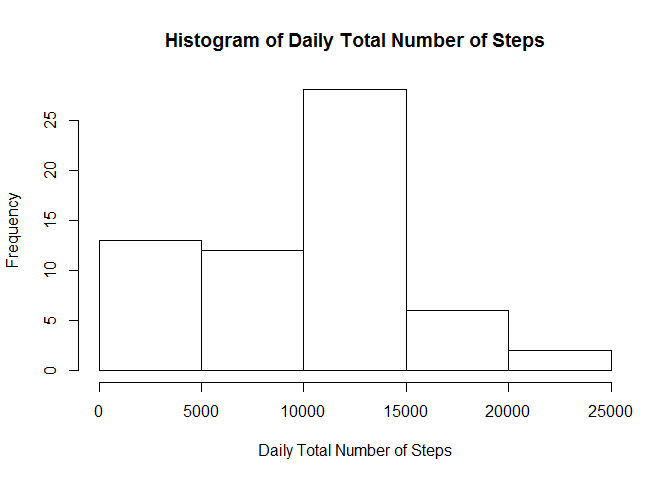
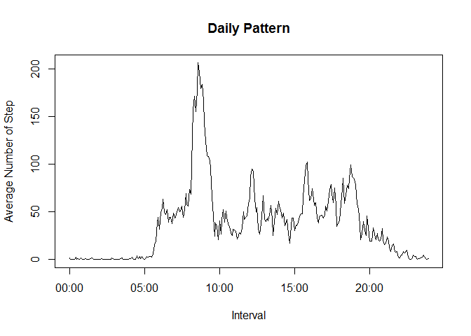
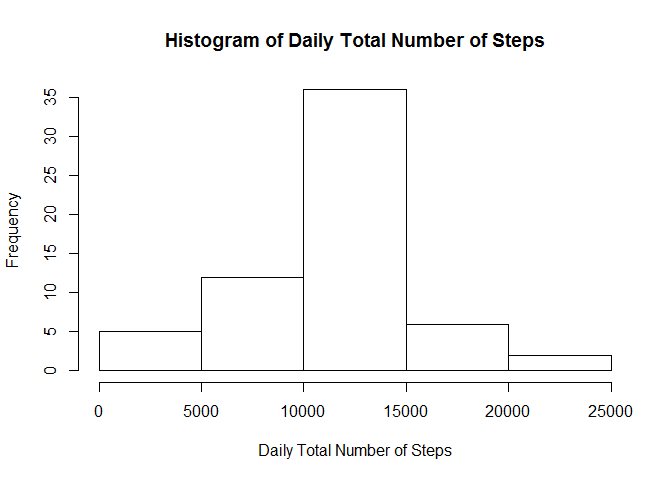
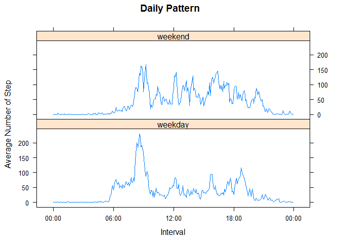

# Reproducible Research: Peer Assessment 1


## Loading and preprocessing the data
We first load the data from a CSV file, *activity.csv*: 


```r
data <- read.csv("activity.csv", na.strings="NA")
summary(data)
```

```
##      steps                date          interval     
##  Min.   :  0.00   2012-10-01:  288   Min.   :   0.0  
##  1st Qu.:  0.00   2012-10-02:  288   1st Qu.: 588.8  
##  Median :  0.00   2012-10-03:  288   Median :1177.5  
##  Mean   : 37.38   2012-10-04:  288   Mean   :1177.5  
##  3rd Qu.: 12.00   2012-10-05:  288   3rd Qu.:1766.2  
##  Max.   :806.00   2012-10-06:  288   Max.   :2355.0  
##  NA's   :2304     (Other)   :15840
```

The second column can be converted into date class and the third column into a time (HourMin) format. The second and third column can then be combined to form a POSIXlt class variable. 


```r
data$date <- as.Date(data$date, "%Y-%m-%d")
dataDateTime <- as.character(data$interval)
dataDateTime[data$interval<10] <- paste("000", dataDateTime[data$interval<10], sep="")
dataDateTime[data$interval>5 & data$interval<100] <- paste("00", dataDateTime[data$interval>5 & data$interval<100], sep="")
dataDateTime[data$interval>55 & data$interval<1000] <- paste("0", dataDateTime[data$interval>55 & data$interval<1000], sep="")
dataDateTime <- paste(data[,"date"], dataDateTime, sep=" ")
dataDateTime <- strptime(dataDateTime, "%Y-%m-%d %H%M")
```

A new pre-processed data is formed by appending the POSIXlt variable as one of the columns.


```r
p_data <- data.frame(date=data$date, time=dataDateTime, interval=data$interval, steps=data$steps)
str(p_data)
```

```
## 'data.frame':	17568 obs. of  4 variables:
##  $ date    : Date, format: "2012-10-01" "2012-10-01" ...
##  $ time    : POSIXct, format: "2012-10-01 00:00:00" "2012-10-01 00:05:00" ...
##  $ interval: int  0 5 10 15 20 25 30 35 40 45 ...
##  $ steps   : int  NA NA NA NA NA NA NA NA NA NA ...
```

## What is mean total number of steps taken per day?

We first calculate the sum of the step for each day and create a histogram, ignoring the missung values. 


```r
sumSteps <- tapply(p_data$steps, p_data$date, sum, na.rm=TRUE)
hist(sumSteps, main = "Histogram of Daily Total Number of Steps", xlab="Daily Total Number of Steps")
```

 

The mean and mean of the total number of steps taken per day are calculated in the following code: 


```r
meanSumStep <- mean(sumSteps)
medianSumStep <- median(sumSteps)
```

The mean and median are 9354.2295082 and 10395, respectively. 

## What is the average daily activity pattern?

To see the average daily activity pattern, We calculate the average number of step for each interval across all days:


```r
dailyPattern <- tapply(p_data$steps, p_data$interval, mean, na.rm=TRUE)
plot(p_data$time[1:length(dailyPattern)], dailyPattern, type="l", main="Daily Pattern", xlab="Interval", ylab="Average Number of Step")
```

 

From the time series plot, the maximum number of step happens between 8-9am. To be exact, we can determine it as follows:


```r
maxNumStepInterval = p_data$interval[which.max(dailyPattern)]
```

The maximum number of step happens at 835.

## Imputing missing values


```r
numNA = sum(is.na(p_data$steps))
```
The total number of missing values in the dataset is 2304.

We adopt the strategy that use 5-minute interval mean to fill in all of the missing values in the dataset.


```r
dailyPatternStack <- rep(round(dailyPattern), length(sumSteps))
p_data$steps[is.na(p_data$steps)] <- dailyPatternStack[is.na(p_data$steps)]
```

We repeat the previous procedures using the new dataset tp calculate the sum of the step for each day and create a histogram. 


```r
newSumSteps <- tapply(p_data$steps, p_data$date, sum)
hist(newSumSteps, main = "Histogram of Daily Total Number of Steps", xlab="Daily Total Number of Steps")
```

 

The mean and mean of the total number of steps taken per day are calculated again using the new dataset: 


```r
newMeanSumStep <- mean(newSumSteps)
newMedianSumStep <- median(newSumSteps)
```

The mean and median for the new dataset are 1.0765639\times 10^{4} and 1.0762\times 10^{4}, respectively.

## Are there differences in activity patterns between weekdays and weekends?

We want to check if there is a difference in activity pattern between weekdays and weekend. To do this, we need to create a new factor variable with two levels "weekday" and "weekend".


```r
p_data$day<-weekdays(p_data$date)
p_data$day[p_data$day=="Saturday" | p_data$day=="Sunday"] <- "weekend"
p_data$day[p_data$day!="weekend"] <- "weekday"
```

Using the factor variable, we can check the activity pattern during weekdays and weekends.


```r
weekendWeekdayPattern <- tapply(p_data$steps, list(p_data$interval, p_data$day), mean)
weekendWeekdayPattern<-as.data.frame(weekendWeekdayPattern)
library(lattice)
x <- c(weekendWeekdayPattern$weekday, weekendWeekdayPattern$weekend)
y <- rep(p_data$time[1:(dim(weekendWeekdayPattern)[1])], 2)
library(chron)
y <- times(format(y, "%H:%M:%S"))
f <- factor(rep(c("weekday", "weekend"), each=dim(weekendWeekdayPattern)[1]))
xyplot(x ~ y | f, layout=c(1,2), panel = panel.lines, main="Daily Pattern", xlab="Interval", ylab="Average Number of Step")
```

 

From the plots, we can see that during weekdays, significant number of steps (around 50) occurs at early interval (around 6 am), while on weekend, it occurs at a later interval (around 8 am). This is logical because during weekdays, the user wakes up early and commute to work, while during weekends, the user can afford to wake up later. Besides, we can see that the number of step reduces to close to zero at around 8 pm during weekend but at around 10 pm during weekend. We can infer that during weekend, the user remains active late in the evening, but not during weekedays because he or she need to wake up early the next day to work. 
